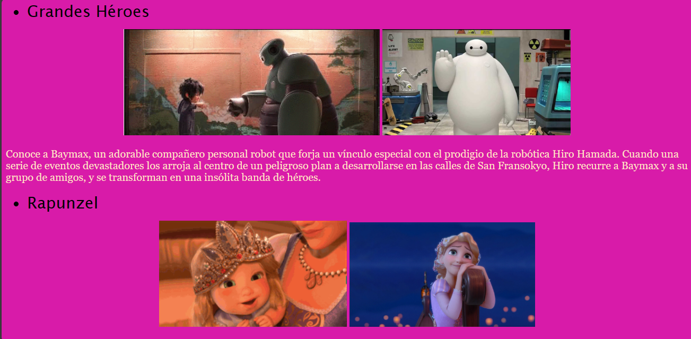

# Mi primera página web

## Descripción proyecto

Primer sitio web desarrollado con HTML para el bootcamp de tecnolochicas PRO, en el cual se lleva a cabo el uso de etiquetas básicas y la carga de recursos externos (imagenes) y links para navegación dentro y fuera del sitio.

### Link del proyecto
[Proyecto desplegado](https://miprimerweb-jatz.netlify.app/)

### Capturas del proyecto

## Tecnologías utilizadas
    HTML

###### Creditos: Jatziry Diaz Gonzalez para el bootcamp de Tecnolochicas PRO
